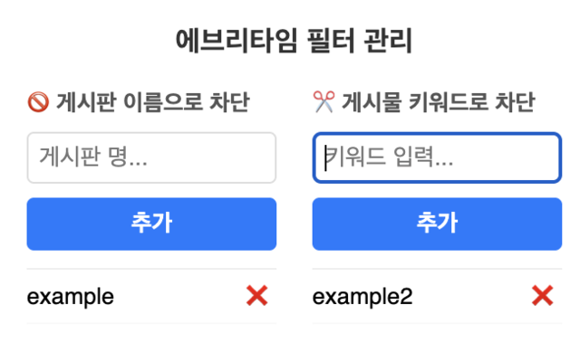
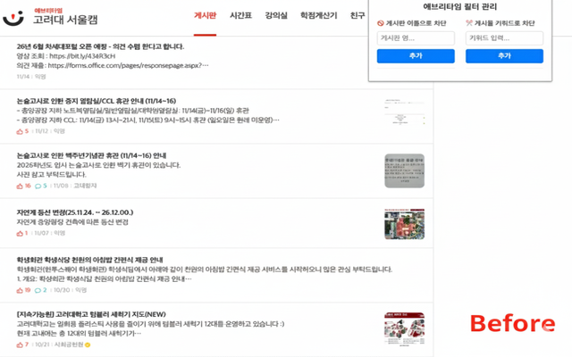
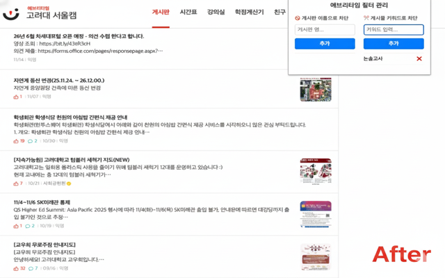

# Everytime Filter Chrome Extension

## Extension URL

<a href="https://chromewebstore.google.com/detail/everytime-filter/iepjlijlhpceekifgcjkkibddlhfahip" target="_blank">https://chromewebstore.google.com/detail/everytime-filter/iepjlijlhpceekifgcjkkibddlhfahip</a>

## Purpose

특정 키워드/게시판명을 Extension에 추가하면 해당 키워드가 포함된 글 혹은 게시판의 글을 차단할 수 있습니다.

## How to use

1. https://chromewebstore.google.com/category/extensions 에 “Everytime Filter” 검색 후 브라우저에 추가
   혹은 https://chromewebstore.google.com/detail/everytime-filter/iepjlijlhpceekifgcjkkibddlhfahip 링크로 접속해 브라우저에 추가
2. 해당 extension 추가 후 차단하고 싶은 게시판명 / 키워드 추가
   

## Features

- Partial Matching  
  게시판명을 100% 정확히 입력하지 않고 일부만 일치하더라도 게시판 차단이 가능합니다.  
  다만 대소문자, 띄어쓰기 등으로 인한 차이가 있다면 차단되지 않으니 정확한 입력이 필요합니다. 키워드 차단의 경우에도 동일합니다.  
  ex) “잡담게시판” 게시판 차단 → “잡담”, "잡담게" 와 같이 입력해도 해당 게시판의 글 차단 가능
- Prefix-based Content Filtering  
  키워드 차단의 경우 게시글의 제목 혹은 초반부(평균 130~150자) 이내에 차단 대상 키워드가 있을 경우 차단하여 추가적인 fetch의 발생으로 인한 부하를 최소화합니다. 

## Sample Usage

- '논술고사' 키워드 차단 설정 이전의 화면  
  
- '논술고사' 키워드 차단 설정 이후의 화면  
  

## Tech Stack

